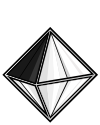

# 

#  d2k.js [![NPM Package][npm]][npm-url] [![Build Size][build-size]][build-size-url] [![NPM Downloads][npm-downloads]][npmtrends-url] [![Dev Dependencies][dev-dependencies]][dev-dependencies-url] [![Twitter Account][twitter]][twitter-url]

> *3d object builder from the Dark side of the Force*

<p style="text-align: right">
  <a href="README.md">english</a> -
  <!-- <a href="./documentation/documentation.readme.fr-FR.md">french</a> -->
</p>    

[Examples](#examples) &mdash; [Getting Started](#getting-started) &mdash; [Syntax](#syntax) &mdash; [API](#api) &mdash; [Tips](#tips) &mdash; [3d objects](#3d-objects) &mdash; [Disclaimer](#disclaimer) &mdash; [License](#license) &mdash; [Support](#support) &mdash; [Contributors](#contributors)

##  Problems ##

- `DRY` (do not repeat yourself)

##  Solutions ##

- automate 3d object creating
- automate scene composing
- support `GLSL` x `THREE` x `BABYLON`
- support `layerization` *(experimental experience)*

## <a name="examples"></a>  Examples ##

**codepen**   

[hello world (glsl)](https://codepen.io/monsieurbadia/pen/wvKmzXM) - [hello world (three.js)](https://codepen.io/monsieurbadia/pen/oNjqzYP) - [hello world (babylon.js)](https://codepen.io/monsieurbadia/pen/GRpxjOV) - [layerization - hello world (babylon.js x three.js)](https://codepen.io/monsieurbadia/pen/ExVEwwJ) - [layerization - virtual joystick (babylon.js x three.js)](https://codepen.io/monsieurbadia/pen/ZEbxpqv)

**jsfiddle**    

[hello world (glsl)](https://jsfiddle.net/_monsieurbadia/j4n19puL) - [hello world (three.js)](https://jsfiddle.net/_monsieurbadia/yga7rf09) - [hello world (babylon.js)](https://jsfiddle.net/_monsieurbadia/b8ju2gmz) - [layerization - hello world (babylon.js x three.js)](https://jsfiddle.net/_monsieurbadia/brq43fsu) - [layerization - virtual joystick (babylon.js x three.js)](https://jsfiddle.net/_monsieurbadia/xz6kmt2e)  

**demo**    

<p align="center">
  
  
  
  
  
  
  
  
  
  
  
  
  
  
  
  
  
  
  
  
  
  
</p>

## <a name="getting-started"></a>  Getting Started ##    

before you start be sure that your project include `three.js` and / or `babylon.js`, once it's good for you, you can install **d2k** using your shell.    

**npm**

```sh
npm i d2k
```

**yarn**

```sh
yarn add d2k
```

**cdn**

[https://rawcdn.githack.com/monsieurbadia/d2k.js/build/d2k.js](https://rawcdn.githack.com/monsieurbadia/d2k.js/d4230cceeb8650911e83a3ff074cb59e59c0e85a/build/d2k.js) - production
[https://raw.githack.com/monsieurbadia/d2k.js/master/build/d2k.js](https://raw.githack.com/monsieurbadia/d2k.js/master/build/d2k.js) - development

then import d2k:

**javascript**

```js
import d2k from 'd2k';
```

**html**

```html
<script src="./src/d2k.js">
```

## <a name="syntax"></a>  Syntax ##

you are able to create 3d object from `THREE` or `BABYLON` following a unique syntax. code snippets below compare the syntaxes using by those librairies and **d2k**.

- ### create a scene

  you can also to chain methods to compose a `scene` step by step. for your information, a `scene` can be created from a `JSON` config file and must respect the following format below.

  [glsl config format](./config/../documentation/configuration/config.glsl.format.md) - [babylon.js config format](./config/../documentation/configuration/config.babylon.format.md) - [three.js config format](./documentation/configuration/config.three.format.md)

  #### using glsl

  *use `GPU` through `shader` with `GLSL`*            

  ```js
  const GLSLstarter = d2k
    .onstarter( { canvas: 'myCanvasId', glsl: true } )
    .use( THREE )
    .withShader( /*  ... */ )
    .value();
  ```

  #### using babylon.js

  *create a scene from the primitives of `BABYLON`*    

  ```js
  var BABYLONstarter = d2k
    .onstarter( { canvas: 'myCanvasId' } )
    .use( BABYLON )
    .withEngine( /* ... */ )
    .withScene( /* ... */ )
    .withLight( /* ... */ )
    .withMesh( /* ... */ )
    .composify( /* ... */ )
    .value();
  ```

  #### using three.js

  *create a scene from the primitives of `THREE`*       
    
  ```js
  var THREEstarter = d2k
    .onstarter( { canvas: 'myCanvasId' } )
    .use( THREE )
    .withCamera( /* ... */ )
    .withMesh( /* ... */ )
    .withRenderer( /* ... */ )
    .withLight( /* ... */ )
    .withLoader( /* ... */ )
    .withScene( /* ... */ )
    .composify( /* ... */ )
    .value();
  ```

- ### create 3d object

  #### scene

  ```js
  // babylon.js
  var scene = new BABYLON.Scene();

  // three.js
  var scene = new THREE.Scene();

  // d2k.js
  .withScene( { name: 'mySceneName' } );
  ```

  #### camera

  ```js
  // babylon.js
  var camera = new THREE.FreeCamera( /* ... */ );

  // three.js
  var camera = new THREE.PerspectiveCamera( /* ... */ );

  // d2k.js
  .withCamera( { name: 'myCameraName' } );
  ```

  #### engine - renderer

  ```js
  // babylon.js
  var engine = new BABYLON.Engine( /* ... */ );

  // three.js
  var renderer = new THREE.WebGLRenderer( /* ... */ );

  // d2k.js
  .withRenderer( { name: 'myRendererName' } );
  ```

  #### mesh

  ```js
  // babylon.js
  var mesh = new BABYLON.MeshBuilder.createBox( /* ... */ );

  // three.js
  var mesh = new THREE.Mesh( /* ... */ );

  // d2k.js
  .withMesh( { name: 'myMeshNameName' } );
  ```

  #### light

  ```js
  // babylon.js
  var pointLight = new BABYLON.PointLight( /* ... */ );

  // three.js
  var pointLight = new THREE.PointLight( /* ... */ );

  // d2k.js
  .withLight( { name: 'myLightName' } );
  ```

  #### loader

  ```js
  // babylon.js
  var assetsManager = new BABYLON.AssetsManager( /* ... */ );

  // three.js
  var textureLoader = new THREE.TextureLoader( /* ... */ );

  // d2k.js
  .withLoader( { name: 'myLoaderName' } );
  ```

- ### create 3d object with parameters

  #### scene

  ```js
  // babylon.js
  var canvas = document.getElementById( 'myCanvasId' );
  var engine = new BABYLON.Engine( canvas, true );
  var scene = new BABYLON.Scene( engine );
  var color = new BABYLON.Color3.Blue();

  scene.clearColor = color
  scene.fogMode = BABYLON.Scene.FOGMODE_EXP;
  scene.fogColor = color;

  // three.js
  var name = 'mySceneName';
  var scene = new THREE.Scene();
  var color = 0x0000ff;
  var near = 10;
  var far = 100;

  scene.background = new THREE.Color( color );
  scene.fog = new THREE.Fog( color, near, far );

  // d2k.js
  .withScene( {
    name: 'mySceneName',
    config: {
      fog: '0x0000ff 10 100',
      background: '0x0000ff'
    }
  } );
  ```

  #### camera

  ```js
  // babylon.js
  var name = 'myCameraName';
  var x = 0;
  var y = 10;
  var z = 20;
  var position = new BABYLON.Vector3( x, y, z );
  var camera = new BABYLON.FreeCamera( name, position, null );

  // three.js
  var name = 'myCameraName';
  var fov = 45;
  var aspect = window.innerWidth / window.innerHeight;
  var near = 0.1;
  var far = 100;
  var position = [ 0, 10, 20 ];
  var camera = new THREE.PerspectiveCamera( fov, aspect, near, far );

  camera.name = name;
  camera.position.fromArray( position );

  // d2k.js
  .withCamera( {
    name: 'myCameraName',
    config: {
      args: [ 45, 2, 0.1, 100 ],
      position: [ 0, 10, 20 ]
    }
  } );
  ```

  #### engine - renderer

  ```js
  // babylon.js
  var canvas = document.getElementById( 'myCanvasId' );
  var width = window.innerWidth;
  var height = window.innerHeight;
  var engine = new BABYLON.Engine( canvas, true );

  engine.setSize( width, height );

  // three.js
  var canvas = document.getElementById( 'myCanvasId' );
  var width = window.innerWidth;
  var height = window.innerHeight;
  var renderer = new THREE.WebGLRenderer( { antialias: true, canvas } );

  renderer.setSize( width, height );

  // d2k.js
  .withRenderer( {
    name: 'myRendererName',
    config: {
      size: [ window.innerWidth, window.innerHeight ]
    }
  } );
  ```

  #### mesh

  ```js
  // babylon.js
  var name = 'myMeshName';
  var options = { size: 1 };
  var mesh = BABYLON.MeshBuilder.CreateBox( name, options, null );

  mesh.position.set( 0, 20, 0 );

  // three.js
  var width = 1;
  var height = 1;
  var depth = 1;
  var geometry = new THREE.BoxGeometry( width, height, depth );
  var material = new THREE.StandardMaterial();
  var mesh = new THREE.Mesh( geometry, material );

  mesh.position.set( 0, 20, 0 );

  // d2k.js
  .withMesh( {
    name: 'myMeshName',
    config: {
      geometry: {
        args: [ 1, 1, 1 ],
        type: 'box-buffer'
      },
      material: {
        type: 'standard'
      },
      position: [ 0, 20, 0 ]
    }
  } );
  ```

  #### light    

  ```js
  // babylon.js
  var name = 'myLightName';
  var x = 0;
  var y = 4;
  var z = 0;
  var position = new BABYLON.Vector3( x, y, z );
  var light = new BABYLON.PointLight( name, new BABYLON.Vector3( x, y, z ), null );

  // three.js
  var name = 'myLightName';
  var color = 0x0000ff;
  var intensity = 1;
  var distance = 100;
  var light = new THREE.PointLight( color, intensify, distance );

  light.name = name;
  light.position.set( 0, 4, 0 );

  // d2k.js
  .withLight( {
    name: 'myLightName',
    config: {
      args: [ '0x0000ff 1 100' ],
      position: [ 0, 4, 0 ]
    }
  } );
  ```

  #### loader

  ```js
  // babylon.js
  var canvas = document.getElementById( 'myCanvasId' );
  var engine = new BABYLON.Engine( canvas, true );
  var scene = new BABYLON.Scene( engine );
  var assetsManager = new BABYLON.AssetsManager( scene );
  var name = 'myLoaderName';
  var url = 'my-texture-path/my-texture-name.jpg';
  var loader = assetsManager.addTextureTask( name, url );

  // three.js
  var name = 'myLoaderName';
  var url = 'my-texture-path/my-texture-name.jpg';
  var loader = new THREE.TextureLoader( url );

  loader.name = 'myLoaderName';

  // d2k.js
  .withLoader( {
    name: 'myLoaderName'
    config: {
      args: [ {
        url: 'my-texture-path/my-texture-name.jpg'
      } ]
      type: 'texture'
    }
  } );
  ```

## <a name="api"></a>  API

### `.onstarter( init )`

  initialize a `scene` from an `init` object pass in parameter. to create a scene `.onstarter()` has to be called first.    

  ##### usage

  `GLSL` x `BABYLON` x `THREE`      

  ##### params

  `init` **{ Object }**: initialize a `starter`.        
  `returns` **{ Object }**: collection of methods.     

  ##### example

  ```js
  var starter = d2k
    .onstarter( {
      canvas: 'myCanvasId',
      glsl: false
    } );
  ```

### `.use( RENDERING_ENGINE )`

  define the current `RENDERING_ENGINE` wich will be used to create primitives. `.use()` has to been calls just after the `.onstarter()` method.    

  ##### usage

  `GLSL` x `BABYLON` x `THREE`    

  ##### params

  `RENDERING_ENGINE` **{ Object }**: the current rendering engine.         
  `returns` **{ Object }**: collection of methods.     

  ##### example

  ```js
  var starter = d2k
    .onstarter( /* ... */ )
    .use( THREE );
  ```

### `.withCamera( config )`

  create a `camera` from an `config` object pass in parameter.    

  ##### usage

  `BABYLON` x `THREE`   

  ##### params

  `config` **{ Object }**: definition of the configuration of a `camera`.     
  `returns` **{ Object }**: collection of methods.    

  ##### example

  ```js
  var starter = d2k
    .onstarter( /* ... */ )
    .use( /* ... */ )
    .withCamera( {
      name: 'myCameraName',
      config: {
        args: [ 75, null, 0.1, 1000 ],
        position: [ 0, 0, 100 ],
        rotation: [ 0, 0, 0 ],
        scale: [ 1, 1, 1 ],
        type: 'perspective'
      }
    } );
  ```

### `.withEngine( config )`

  define an `engine` from a `config` object passed as a parameter.    

  ##### usage

  `BABYLON`   

  ##### params

  `config` **{ Object }**: a `engine` config.     
  `returns` **{ Object }**: collection of methods.      

  ##### example

  ```js
  var starter = d2k.onstarter( /* ... */ )
    .use( BABYLON )
    .withEngine( { name: 'myEngineName' } );
  ```

### `.withMesh( config )`

  create a `mesh` from an `config` object pass in parameter.    

  ##### usage

  `BABYLON` x `THREE`

  ##### params

  `config` **{ Object }**: a `mesh` config.     
  `returns` **{ Object }**: collection of methods.    

  ##### example

  ```js
  var starter = d2k.onstarter( /* ... */ )
    .use( /* ... */ )
    .withMesh( {
      name: 'myMeshName',
      config: {
        position: [ -20, 0, 0 ],
        geometry: {
          args: [ 20, 20, 20 ],
          type: 'box-buffer'
        },
        material: {
          args: { 'transparent': true },
          type: 'mesh-normal'
        },
      }
    } );
  ```

### `.withLight( config )`

  create a `light` from a `config` object pass in parameter.       

  ##### usage

  `BABYLON` x `THREE`   

  ##### params

  `config` **{ Object }**: a `light` config.    
  `returns` **{ Object }**: collection of methods.    

  ##### example

  ```js
  var starter = d2k.onstarter( /* ... */ )
    .use( /* ... */ )
    .withLight( {
      name: 'myLightName',
      config: {
        args: [ '0xf1f5bb' ],
        position: [ 0, 1, 30 ],
        type: 'directional'
      }
    } );
  ```

### `.withLoader( config )`

  load a `texture` | `object` from a `config` object to pass in parameter.    

  ##### usage

  `THREE`   

  ##### params

  `config` **{ Object }**: a `loader` config.     
  `returns` **{ Object }**: collection of methods.    

  ##### example

  ```js
  var starter = d2k.onstarter( /* ... */ )
    .use( THREE )
    .withLoader( {
      name: 'myLightName',
      config: {
        args: [ '0xf1f5bb' ],
        position: [ 0, 1, 30 ],
        type: 'directional'
      }
    } );
  ```

### `.withRenderer( config )`

  create a `renderer` from a `config` object pass parameter.

  ##### usage

  `THREE`   

  ##### params

  `config` **{ Object }**: a `renderer` config.  
  `returns` **{ Object }**: collection of methods.  

  ##### example

  ```js
  var starter = d2k.onstarter( /* ... */ )
    .use( /* ... */ )
    .withRenderer( {
      name: 'myRendererName',
      config: {
        antialias: true,
        autoClear: true,
        pixelRatio: null,
        size: [],
        type: "webgl"
      }
    } );
  ```

### `.withScene( config )`

  compose a `scene` from a `config` object pass in parameter.   

  ##### usage

  `BABYLON` x `THREE`     

  ##### params

  `config` **{ Object }**: a `scene` config.    
  `returns` **{ Object }**: collection of methods.  

  ##### example

  ```js
  var starter = d2k.onstarter( /* ... */ )
    .use( /* ... */ )
    .withScene( { name: 'mySceneName' } );
  ```

### `.withShader( config )`

  create `shader` from a `config` object pass in parameter.   

  ##### usage

  `GLSL`    

  ##### params

  `config` **{ Object }**: a `shader` config.    
  `returns` **{ Object }**: collection of methods.  

  ##### example

  ```js
  var starter = d2k.onstarter( /* ... */ )
    .use( THREE )
    .withShader( {
      name: 'myShaderName',
      config : {
        vertexShader: `
          void main () {
            gl_Position = vec4(position, 1.0);
          }
        `,
        fragmentShader: `
          uniform vec2 resolution;
          uniform float time;

          void main () {
            vec2 st = gl_FragCoord.xy / resolution.xy;
            gl_FragColor = vec4(st.x, st.y, 0.0, 1.0);
          }
        `
      }
    } );
  ```

### `.onrender( TARGET: THREEstarter, SOURCE?: BABYLONstarter )`

  create a `scene` from a `TARGET` and a `SOURCE` pass in parameters. ***note: this method will get two different `starter` to merge them and display the two scenes through a single canvas. be careful, this part is still experimental.***   

  ##### usage

  `BABYLON` x `THREE`

  ##### params

  `TARGET` **{ Object }**: a `THREEstarter` starter.   
  `SOURCE` **{ Object }**: a `BABYLONstarter` starter.   
  `returns` **{ Object }**: a `renderer`.   

  ##### example

  ```js
  // babylon.js
  BABYLONstarter.renderer.onrender( {
    engine: BABYLONstarter.engine.myEngineName
    scene: BABYLONstarter.scene.mySceneName
  } );
  ```

  ```js
  // three.js
  THREEstarter.renderer.onrender( {
    renderer: THREEstarter.renderer,
    scene: THREEstarter.scene.main,
    camera: THREEstarter.camera.main
  } );
  ```

  ```js
  // layerization (three.js x babylon.js)
  d2k.onrender( {
    renderer: THREEstarter.renderer.current,
    scene: THREEstarter.scene.mySceneName,
    camera: THREEstarter.camera.current
  }, {
    engine: BABYLONstarter.engine.current,
    scene: BABYLONstarter.scene.mySceneName
  } );
  ```

### `.composify( config )`

  *composition of the scene to be displayed. This method allows you to compose a scene step by step.*       

  ##### usage

  `BABYLON` x `THREE`   

  ##### params

  `config` **{ Object }**: a `composify` config.    
  `returns` **{ Object }**: a `renderer`.   

  ##### example

  ```js
  var starter = d2k.composify( {
    config: {
      start: true,
      scene: {
        main: 'mySceneName',
      },
      mesh: [ {
        name: 'myMeshName',
        parent: 'main'
      } ],
      camera: {
        main: 'myCameraName',
      },
      renderer: 'myRendererName'
    }
  } );
  ```

### `.value()`

  *return a `starter` object that contains a collection of 3d objects. ***note: `.value()` can be called at any time during the creation step `with`.****   

  ##### usage

  `GLSL` x `BABYLON` x `THREE`

  ##### params

  `no params`     
  `returns` **{ Object }**: a `starter` collection.    

  ##### example

  ```js
  var starter = d2k
    .onstarter( /* ... */ )
    .use( /* ... */ )
    .withCamera( /* ... */ )
    .value();
  ```

### `starter`
  
  *contains a collection of 3d objects you have created and some methods.*    

### `events`

  *`mesh` `light` `camera` hold events which are called in specific contexts `onrender` `onloader` `onresize`.*     

  ##### onloader

  ```js
  // data
  starter.mesh.myMeshName.onloader( function ( data ) { /* ... */ } );
  ```

  ##### onrender

  ```js
  // update
  starter.mesh.myMeshName.onrender( function ( timer ) { /* ... */ } );
  ```

  ##### onresize

  ```js
  // resize
  starter.mesh.myMeshName.onresize( function ( size ) { /* ... */ } );
  ```

## <a name="tips"></a>  Tips 

- ### create a scene - fetch

  #### from glsl

  ```js
  fetch( 'https://mydomain.com/v0/my/scene/config/endpoint' )
    .then( function ( response ) { return response.json(); } )
    .then( function ( data ) {

      var scene = data.scene;
      var starter = d2k
        .onstarter( scene.init )
        .use( THREE )
        .withShader( scene.shader )
        .value();

    } );
  ```

  #### from babylon.js

  ```js
  fetch( 'https://mydomain.com/v0/my/scene/config/endpoint' )
    .then( function ( response ) { return response.json(); } )
    .then( function ( data ) {

      var scene = data.scene;
      var starter = d2k
        .onstarter( { canvas: 'myCanvasId' } )
        .use( BABYLON )
        .withEngine( scene.engine )
        .withScene( scene.scene )
        .withCamera( scene.camera )
        .withLight( scene.light )
        .withMesh( scene.mesh )
        .value();

    } );
  ```

  #### from three.js

  ```js
  fetch( 'https://mydomain.com/v0/my/scene/config/endpoint' )
    .then( function ( response ) { return response.json(); )
    .then( function ( data ) {

      var scene = data.scene;
      var starter = d2k
        .onstarter( { canvas: 'myCanvasId' } )
        .use( THREE )
        .withCamera( scene.camera )
        .withRenderer( scene.renderer )
        .withMesh( scene.mesh )
        .withLight( scene.light )
        .withScene( scene.scene )
        .value();

    } );
  ```

## <a name="tips"></a>  3d objects

3d objects        | babylon.js                               | three.js                                 |
------------------|------------------------------------------|------------------------------------------|
audio             |  |  |
camera            |    |    |
font              |  |  |
geometry          |  |    |
group             |  |    |
light             |    |    |
loader            |  |    |
material          |    |    |
mesh              |    |    |
renderer          |    |    |
scene             |    |    |

## <a name="disclaimer"></a>  Disclaimer

I am not a developer, I am a normal guy who carries programming in his heart and wants to contribute to open source and help the 3d community. for now, this project is just an experimental version of an idea I had in mind. But my idea will evolve through this project so my design errors will disappear as long as i progress. changes will be coming for everyone's comfort, I hope. triforce! 

##  References

- [Mr.doob's Code Style™](https://github.com/mrdoob/three.js/wiki/Mr.doob's-Code-Style%E2%84%A2)
- [BabylonJS](http://www.babylonjs.com)
- [three.js](https://threejs.org)

##  License

Copyright ©️ 2020 monsieurbadia

Released under the [MIT](https://github.com/monsieurbadia/glsl-reports/blob/master/LICENSE.md) license

## <a name="support"></a>  Support

*⭐️ this repository if this project helped you! you're a BAWS*    

##  Contributors

logo - [@Mlle_Martinss](https://twitter.com/Mlle_Martinss)        
icons - [@AdrienCoquet](https://twitter.com/AdrienCoquet)     
code - [@monsieurbadia](https://twitter.com/monsieurbadia)       

[npm]: https://img.shields.io/npm/v/d2k
[npm-url]: https://www.npmjs.com/package/d2k
[build-size]: https://badgen.net/bundlephobia/minzip/d2k
[build-size-url]: https://bundlephobia.com/result?p=d2k
[npm-downloads]: https://img.shields.io/npm/dw/d2k
[npmtrends-url]: https://www.npmtrends.com/d2k
[dev-dependencies]: https://img.shields.io/david/dev/monsieurbadia/d2k.js
[dev-dependencies-url]: https://david-dm.org/monsieurbadia/d2k.js#info=devDependencies
[twitter]: https://img.shields.io/twitter/follow/monsieurbadia?label=follow
[twitter-url]: https://twitter.com/monsieurbadia
