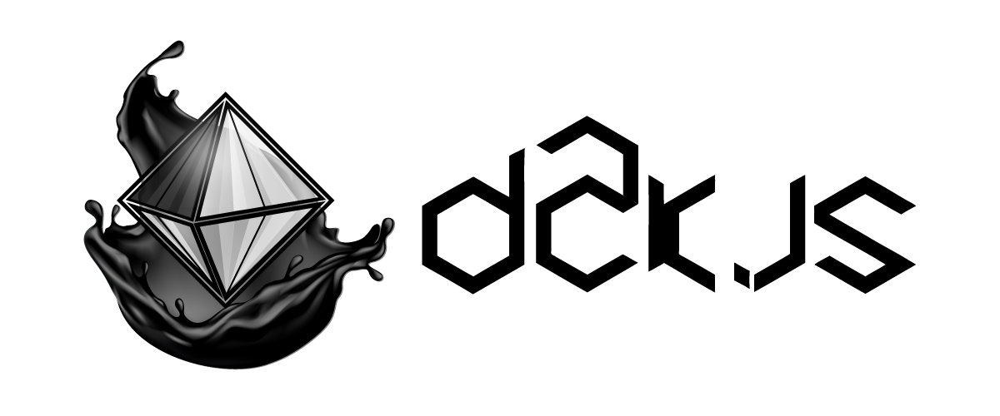

# 

#  d2k.js <!-- [![NPM Package][npm]][npm-url] [![Build Size][build-size]][build-size-url] [![NPM Downloads][npm-downloads]][npmtrends-url] [![Dev Dependencies][dev-dependencies]][dev-dependencies-url] -->

> *micro-surcouche javascript basé sur [three.js](https://threejs.org) x [babylon.js](https://www.babylonjs.com) pour créer des scènes 3d rapidement de façon intuitive, élégante et fonctionnelle.*

<a href="https://twitter.com/monsieurbadia"> suis moi sur twitter</a>

[anglais](../README.md) - [français](./documentation.readme.fr.md)    

##  Problèmes

- implémenter la même chose entre chaque projet (don't repeat yourself).
- manque d'innovation des starters webgl du type `three-starter-de-la-mort-qui-tue` `vue-babylon-starter++` etc.
- perdre mon temps pour afficher un simple cube.
- manque de fonctionnalités dans certaines librairies de moteur 3d.
- api webgl trop complexe pour donner envie aux jeunes de s'intéresser à la programmation 3d.
- contre cette guerre "babylon vs three" sur la toile.

##  Solutions

- automatiser la création des primitives.
- automatiser la composition de la scène
- définir une abstraction plus simplifiée.
- implémenter des nouvelles fonctionnalités aux primitives.
- créer une ou plusieurs scène(s) à partir d'un fichier `.json`.
- switcher entre babylon et three en une seule ligne de code.
- créer des expériences expérimentales comme par exemple être capable de faire un `Object.assign( THREE, BABYLON )`, qui donnerait à un canvas unique la possibilité d'afficher les deux scènes en simultanée à l'écran.

##  Objectifs

- supporter `GLSL`
- supporter `THREE`
- supporter `BABYLON`
- supporter `JSON`
- supporter `Object.assign( THREE, BABYLON )`
- supporter `chrome` `edge` `firefox` `safari`
- ne passer dépasser les `50 KB`

##  Avertissement

je ne suis pas un développeur, je suis un gars normal qui porte la programmation dans son coeur, souhaite contribuer à l'open source et aider la communauté 3d. pour l'instant, il ne s'agit que d'une version expérimentale d'une idée que j'avais en tête. Mais mon idée va évoluer à travers ce projet donc mes erreurs de conception, avec le temps, disparaîtrons. des changements seront à venir pour le confort de tous, je l'espère. triforce !

##  Installation    
    
avant de commencer soit sûre d'avoir dans ton projet `three.js` et/ou `babylon.js` une fois que c'est bon pour toi, tu peux installer **d2k** via ton terminal.    

**terminal**

```sh
npm i d2k
```

OU

```sh
yarn add d2k
```

voilà, le projet est installé. vérifie tout de même dans `.package.json` si il se trouve bien dans les dépendances de ton application.

**alternative**

télécharge le projet, copie le fichier `d2k.js` qui se situe dans le dossier `/dist` ensuite libre à toi de l'installer dans l'endroit prévu à cet effet dans ton application.

##  Démarrer le projet

maintenant, tu n'as plus qu'à importer **d2k** dans ton module ou ta page html.

**ecmascript**

```js
import d2k from 'd2k';
```

**html | javascript**

```html
<script src="./d2k.js"></script>
```

##  Syntaxe

voici un aperçu de la syntaxe de **d2k** qui permet de faire du chaînage de méthodes pour composer une `scene` étape par étape.

**glsl starter**

crée une scène 100% `gpu` au travers des `shader` en `glsl`   

```js
const GLSLstarter = d2k.onstarter( { glsl: true } )
  .use( THREE ) // <-- use three and enable glsl shader
  .withShader()
  .value();
```

**babylon starter**

crée une scène à partir des primitives provenant de `BABYLON`    

```js
const BABYLONstarter = d2k.onstarter()
  .use( BABYLON ) // <-- use babylon
  .withEngine()
  .withScene()
  .withLight()
  .withMesh()
  .value();
```

**three starter**

crée une scène à partir des primitives fournit par `THREE`   

```js
const THREEstarter = d2k.onstarter()
  .use( THREE ) // <-- use three
  .withCamera()
  .withMesh()
  .withRenderer()
  .withLight()
  .withScene()
  .value();
```

**mesh events**

chaque mesh détient des méthodes d'évènements qui sont appelés dans des contextes précis `onrender` `onloader`

```js
starter.mesh.myMeshName.onrender( timer => starter.mesh.myMeshName.rotation.set( time, time, 0 ) );
```

##  API

- ### `d2k.onstarter( init )`

  *initialise une `scene` à partir d'un objet `init` passer en paramètre de la méthode `.onstarter`*

  ##### paramètres

  `init` **{ Object }**: initialisation d'un `starter`    
  `returns` **{ Object }**: collection de méthodes.     

  ##### exemple

  ```js
  const starter = d2k.onstarter( {
    canvas: document.getElementById( 'myCanvasId' ),
    glsl: false
  } );
  ```

  - ### `.use( RENDERING_ENGINE )`

    *définit un `RENDERING_ENGINE` à partir de la bibliothèque `BABYLON` | `THREE` passer en paramètre de la méthode `.use`*

    ##### paramètres

    `RENDERING_ENGINE` **{ Object }**: la librairie souhaitée `THREE` | `BABYLON`     
    `returns` **{ Object }**: collection de méthodes.     

    ##### exemple

    ```js
    const starter = d2k.onstarter( /* init */ )
      .use( THREE );
    ```

  - ### `.withCamera( config )`

    *crée une `camera` à partir d'un objet `config` passer en pamètre de la méthode `.withCamera`*

    ##### paramètres

    `config` **{ Object }**: définition de la config d'une `camera`.  
    `returns` **{ Object }**: collection de méthodes. 

    ##### exemple

    ```js
    const starter = d2k.onstarter( /* init */ )
      .use( BABYLON || THREE )
      .withCamera( {
        name: 'myCameraName',
        config: {
          args: [ 75, window.innerWidth / window.innerHeight, 0.1, 1000 ],
          position: [ 0, 0, 100 ],
          type: "perspective"
      } );
    ```

  - ### `.withEngine( config )`

    *définit un `engine` à partir d'un objet `config` passer en paramètre de la méthode `.withEngine`*

    ##### paramètres

    `RENDERING_ENGINE` **{ Object }**: la librairie souhaitée `THREE` | `BABYLON`     
    `returns` **{ Object }**: collection de méthodes.     

    ##### exemple

    ```js
    const starter = d2k.onstarter( /* init */ )
      .use( BABYLON || THREE )
      .withEngine( { name: 'myEngineName' } );
    ```

  - ### `.withMesh( config )`

    *crée un `mesh` à partir d'un objet `config` passer en paramètre de la méthode `.withMesh`*

    ##### paramètres

    `config` **{ Object }**: définition de la config d'un `mesh`  
    `returns` **{ Object }**: collection de méthodes. 

    ##### exemple

    ```js
    const starter = d2k.onstarter( /* init */ )
      .use( BABYLON || THREE )
      .withMesh( {
        name: "myMeshName",
        config: {
          geometry: {
            args: [ 20, 20, 20 ],
            type: "box-buffer"
          },
          material: {
            args: { "transparent": true },
            type: "mesh-normal"
          },
          positions: [ -20, 0, 0 ],
          scene: "scene1",
          group: ""
        }
      } );
    ```

  - ### `.withLight( config )`

    *crée une `light` à partir d'un objet `config` passer en paramètre de la méthode `.withLight`*

    ##### paramètres

    `config` **{ Object }**: définition de la config d'une `light`  
    `returns` **{ Object }**: collection de méthodes. 

    ##### exemple

    ```js
    const starter = d2k.onstarter( /* init */ )
      .use( BABYLON || THREE )
      .withLight( {
        name: "myLightName",
        config: {
          pixelRatio :null,
          size: [],
          camera: "current",
          scene: "scene1"
        }
      } );
    ```

  - ### `.withLoader( config )`

    *charge un(e) `texture` `object` à partir d'un objet `config` passer en paramètre de la méthode `.withLoader`*

    ##### paramètres

    `config` **{ Object }**: définition de la config d'un `loader`  
    `returns` **{ Object }**: collection de méthodes. 

    ##### exemple

    ```js
    const starter = d2k.onstarter( /* init */ )
      .use( BABYLON || THREE )
      .withLoader( {
        name: "myLoaderName",
        config: {
          option: {
            args: [ { name: "myImage1Name", url: "./my-image-2-path.jpg" }, { name: "myImage2Name", url: "./my-image-2-path.jpg" } ],
            type: "texture"
          }
        }
      } );
    ```

  - ### `.withRenderer( config )`

    *crée un `renderer` à partir d'un objet `config` passer paramètre de la méthode `.withRenderer`*

    ##### paramètres

    `config` **{ Object }**: définition de la config d'un `renderer`  
    `returns` **{ Object }**: collection de méthodes. 

    ##### exemple

    ```js
    const starter = d2k.onstarter( /* init */ )
      .use( BABYLON || THREE )
      .withRenderer( {
        name: "myRendererName",
        config: {
          pixelRatio :null,
          size: [],
          camera: "current",
          scene: "scene1"
        }
      } );
    ```

  - ### `.withScene( config )`

    *compose une `scene` à partir d'un objet `config` passer en paramètre de la méthode `.withScene`*

    ##### paramètres

    `config` **{ Object }**: définition la config d'une `scene`  
    `returns` **{ Object }**: collection de méthodes. 

    ##### exemple

    ```js
    const starter = d2k.onstarter( /* init */ )
      .use( BABYLON || THREE )
      .withScene( {
        name: "mySceneName",
        config: {
          mesh: [ "myMeshName" ],
          light: [ "myLightName" ],
          camera: {
            main: "myCameraName",
            others: []
          },
          renderer: "myRendererName"
        }
      } );
    ```

  - ### `.withShader( config )`

    *crée des `shader` à partir d'un objet `config` passer en paramètre de la méthode `.withShader`*

    ##### paramètres

    `config` **{ Object }**: définition la config des `shader`  
    `returns` **{ Object }**: collection de méthodes. 

    ##### exemple

    ```js
    const starter = d2k.onstarter( /* init */ )
      .use( BABYLON || THREE )
      .withShader( {
        name: 'myShaderName',
        config : {
          vertexShader: `
            void main () {
              gl_Position = vec4(position, 1.0);
            }
          `,
          fragmentShader: `
            uniform vec2 resolution;
            uniform float time;

            void main () {
              vec2 st = gl_FragCoord.xy / resolution.xy;
              gl_FragColor = vec4(st.x, st.y, 0.0, 1.0);
            }
          `
        }
      } );
    ```

- ### `d2k.onlayering( TARGET, SOURCE )`

  *crée une `scene` à partir d'une `TARGET` et d'une `SOURCE` passer en paramètres de la méthode `.onlayering`. cette méthode va récupérer deux `starter` différents pour les fusionner et afficher les deux scènes a travers un canvas unique. nb: attention, cette partie est encore expérimentale.*   

  ##### paramètres

  `TARGET` **{ Object }**: un starter `THREE`
  `SOURCE` **{ Object }**: un starter `BABYLON`
  `returns` **{ Object }**: un `renderer`.   

  ##### exemple

  ```js
  const starter = d2k.onlayering( THREEstarter, BABYLONstarter );
  ```

- ### `starter`
  
  *contient l'ensemble de primitives que tu as créé à l'aide des méthodes `.with*`*

##  Configuration

*une `scene` peut être créer à partir d'un fichier `.json` qui devra respecté le format suivant : [.json format](./config/config.format.md)*    

**default fetch**

```js
fetch( 'https://mydomain.com/my/scene/config/endpoint' )
  .then( response => response.json() )
  .then( sceneConfig => {
    
    const canvas = document.createElement( "canvas" );
    const starter = d2k.onstarter( { canvas } )
      .use( THREE )
      .withLoader( sceneConfig.loader )
      .withCamera( sceneConfig.camera )
      .withRenderer( sceneConfig.renderer )
      .withMesh( sceneConfig.mesh )
      .withLight( sceneConfig.light )
      .withScene( sceneConfig.scene )
      .value();

    document.body.appendChild( canvas );

  } );
```

**async fetch**

```js
const fetchStarterScene = async ( url ) => {

  const response = await fetch( url );
  const sceneConfig = await response.json();
  const canvas = document.createElement( "canvas" );
  const data = d2k.onstarter( { canvas } )
    .use( THREE )
    .withLoader( sceneConfig.loader )
    .withCamera( sceneConfig.camera )
    .withRenderer( sceneConfig.renderer )
    .withMesh( sceneConfig.mesh )
    .withLight( sceneConfig.light )
    .withScene( sceneConfig.scene )
    .value();

  document.body.appendChild( canvas );

  return data;

};

fetchStarterScene( 'https://mydomain.com/my/scene/config/endpoint' );
```

##  Primitives

primitive         | babylon.js                                  | three.js                                    |
------------------|---------------------------------------------|---------------------------------------------|
audio             |  |  |
camera            |    |    |
font              |  |  |
geometry          |  |    |
group             |  |    |
light             |    |    |
loader            |  |    |
material          |    |    |
mesh              |    |    |
renderer          |    |    |
scene             |    |    |

##  Références

- [Mr.doob's Code Style™](https://github.com/mrdoob/three.js/wiki/Mr.doob's-Code-Style%E2%84%A2)
- [BabylonJS](http://www.babylonjs.com)
- [three.js](https://threejs.org)

##  License

Copyright ©️ 2019 monsieurbadia

Released under the [MIT](https://github.com/monsieurbadia/glsl-reports/blob/master/LICENSE.md) license

##  Support

*N'hésite pas à mettre une ⭐ si ce projet t'a aidé.*  

##  Contributeurs

logo - [@mllemartins](https://twitter.com/mllemartins)        
icons - [@AdrienCoquet](https://twitter.com/AdrienCoquet)     
code - [@monsieurbadia](https://twitter.com/monsieurbadia)       

[npm]: https://img.shields.io/npm/v/d2k
[npm-url]: https://www.npmjs.com/package/d2k
[build-size]: https://badgen.net/bundlephobia/minzip/d2k
[build-size-url]: https://bundlephobia.com/result?p=d2k
[npm-downloads]: https://img.shields.io/npm/dw/d2k
[npmtrends-url]: https://www.npmtrends.com/d2k
[dev-dependencies]: https://img.shields.io/david/dev/monsieurbadia/d2k.js
[dev-dependencies-url]: https://david-dm.org/monsieurbadia/d2k.js#info=devDependencies
